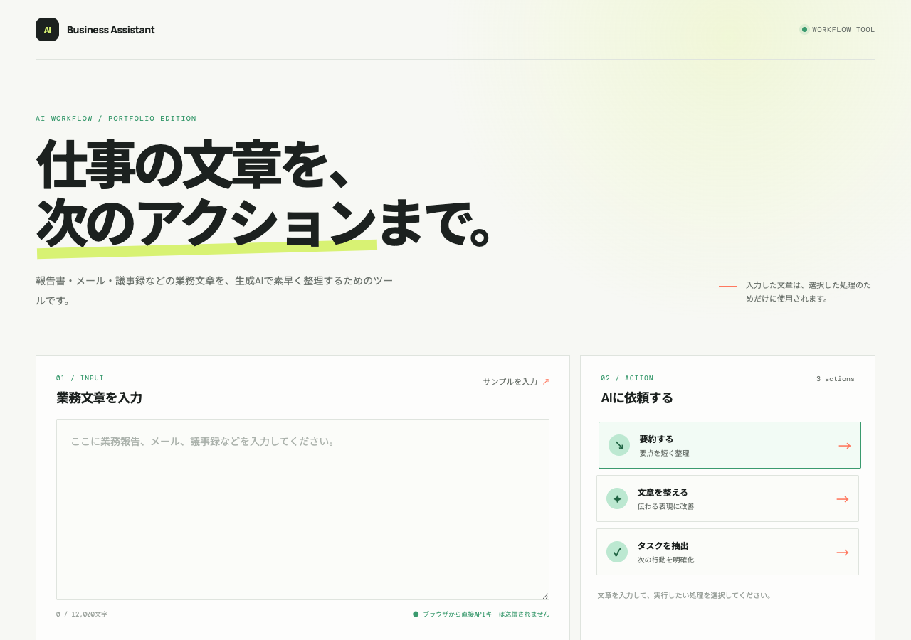
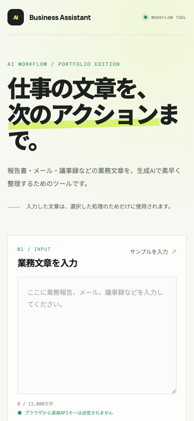

# AI Business Assistant

## 業務文章を、要約・改善・タスクへ変換するWebアプリ

業務報告、メール、議事録などの文章を入力し、生成AIで次の処理を行うポートフォリオ用Webアプリです。

- **要約:** 長い文章の要点を整理
- **文章改善:** 内容を変えず、伝わりやすい表現へ調整
- **タスク抽出:** 文章から実行すべき行動を抽出

画面設計、LLM API連携、入力検証、エラー処理、レスポンシブUI、Cloudflare Workersへの公開、ローカルLLMとの安全な接続までを小さく一通り実装しています。

## まず試す

- **[Live Demoを開く](https://ai-business-assistant.katamachi.workers.dev)**
- **[ソースコードを見る](https://github.com/second-works/ai-business-assistant)**
- **[構成・設計の説明書を読む](docs/PORTFOLIO_GUIDE.md)**

## 想定する利用シーン

- 日報や作業報告から、共有すべき要点をまとめる
- メールや社内連絡を、相手に伝わりやすい文章へ整える
- 議事録や依頼文から、担当者・期限・作業内容を確認する
- AIを使った業務支援ツールのUIとAPI連携を小さく検証する

## 画面

  
  

## 主な機能

- 業務文章の入力と処理種別の選択
- 要約、文章改善、タスク抽出
- 処理中の二重送信防止
- APIエラー、タイムアウト、空回答の表示
- 結果のワンクリックコピー
- PC / スマートフォン向けレスポンシブUI
- 入力上限8,000文字、リクエスト本文64KBの制限
- <code>POST /api/process</code> によるサーバー側処理

## 構成と安全設計

公開WorkerからローカルLLMへ直接接続せず、専用の接続経路と認証境界を置いています。

~~~mermaid
flowchart LR
    U[ブラウザ]
    W[Cloudflare Workers Next.js Route Handler]
    R[Rate Limiting 10回 / 60秒 / IP]
    T[Cloudflare Tunnel]
    B[専用LLMブリッジ 127.0.0.1:8765]
    P[llama-proxy]
    L[llama-server Gemma 4 E4B]

    U -->|POST /api/process| W
    W --> R
    W -->|専用パス・Bearer認証| T
    T --> B
    B --> P
    P --> L
~~~

- LLM接続情報とBearerトークンはブラウザへ返さない
- APIキーやSecretを<code>NEXT_PUBLIC_</code>の環境変数やソースコードへ含めない
- 専用ブリッジは<code>127.0.0.1:8765</code>で待ち受け、認証済みのChat Completionsだけを転送
- <code>llama-server</code>やOpenClaw Gatewayを直接インターネットへ公開しない
- WorkerはIP単位で10回 / 60秒のRate Limitingを適用
- Cloudflare AccessによるOrigin保護を組み合わせられる構成
- Rate Limitingは認証の代替ではなく、初版にログイン機能はない

## 実装済みと初版の対象外

### 実装済み

- Next.js / React / TypeScriptによるUI
- OpenAI互換 Chat Completions APIとの接続
- 処理種別ごとのプロンプト切り替え
- 入力検証、文字数・本文サイズ制限
- LLM通信のタイムアウトとエラー変換
- Cloudflare Workers（OpenNext）へのデプロイ
- Cloudflare Tunnelと専用LLMブリッジの接続
- ローカルのGemma 4 E4Bを使った推論経路
- Rate LimitingとSecret管理

### 初版で実装しないもの

ログイン、ユーザー登録、データベース、利用履歴、課金、管理画面、複数LLM切り替え、RAG、ファイルアップロード、音声入力、MCP、AIエージェントは対象外です。

この作品は、機密文書を保存・管理する業務システムではありません。実運用で機密情報を扱う場合は、認証、権限、ログ、保存範囲、利用モデルの規程を別途設計します。

## 案件で応用できること

- 業務フローに合わせた入力フォームと処理画面の設計
- 要約、文章改善、分類、抽出などのLLM機能の組み込み
- OpenAI互換APIやローカルLLMとの接続
- 入力上限、タイムアウト、エラー表示などの実運用向け制御
- APIキーや接続情報をブラウザへ公開しない構成
- Cloudflare Workersへの小規模公開
- Cloudflare Tunnel、専用ブリッジ、Rate Limitingを組み合わせた接続境界

## 使用技術

| 領域 | 技術 |
| --- | --- |
| UI | Next.js、React、TypeScript |
| LLM | OpenAI互換 Chat Completions API、Gemma 4 E4B |
| API | Next.js App Router Route Handler |
| 公開 | Cloudflare Workers、OpenNext、Wrangler |
| 接続 | Cloudflare Tunnel、専用LLMブリッジ、llama-proxy |
| 品質 | TypeScript typecheck、production build |

## ローカル開発

~~~bash
npm install
cp .env.example .env.local
npm run dev
~~~

ブラウザで <http://localhost:3000> を開きます。

<code>.env.local</code> には接続先に応じたサーバー側設定を入れます。

~~~dotenv
OPENAI_API_KEY=your-api-key
OPENAI_BASE_URL=https://api.openai.com/v1
OPENAI_MODEL=gpt-4o-mini
LLM_ACCESS_CLIENT_ID=
LLM_ACCESS_CLIENT_SECRET=
~~~

APIキーやAccess SecretはGitへ保存せず、公開環境ではWrangler Secretを使用します。

## 検証と公開

型チェックと本番ビルドを実行します。

~~~bash
npm run typecheck
npm run build
~~~

Cloudflare Workersへ初めて公開する場合は、必要なSecretを登録してからデプロイします。

~~~bash
npx wrangler secret put OPENAI_API_KEY

# Cloudflare Access Service Authを使う場合
npx wrangler secret put LLM_ACCESS_CLIENT_ID
npx wrangler secret put LLM_ACCESS_CLIENT_SECRET

npm run deploy
~~~

<code>OPENAI_BASE_URL</code> と <code>OPENAI_MODEL</code> は接続先に合わせて <code>wrangler.jsonc</code> で設定します。Cloudflare Tunnelや専用LLMブリッジを別環境へ移植する場合は、[ポートフォリオ向け説明書](docs/PORTFOLIO_GUIDE.md)の構成、Secret管理、入力制限、運用上の注意を確認してください。
