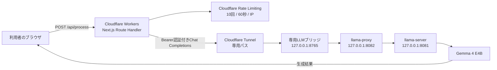

# AI Business Assistant 説明書

## 1. 作品概要

AI Business Assistantは、業務報告、メール、議事録などの文章を生成AIで処理するWebアプリです。

利用者は文章を入力し、次の三つの処理から一つを選びます。

- 要約：文章の要点を短く整理する。
- 文章改善：社内外の相手に伝わりやすい表現へ整える。
- タスク抽出：文章から実行すべき行動をチェックリスト形式で抽出する。

公開URLは次のとおりです。

<https://ai-business-assistant.katamachi.workers.dev>

この作品は、生成AIを利用した小規模な業務効率化Webアプリを、画面設計からAPI連携、セキュリティ対策、公開まで一通り実装した例として制作しています。

## 2. 想定利用シーン

利用者が業務文章を入力すると、ブラウザはWorkerのAPIへ処理内容と文章を送信します。

Workerは選択された処理に対応するプロンプトを組み立て、非公開のLLM接続経路へリクエストを転送します。

生成された結果はWorkerからブラウザへ返され、画面上で確認できます。

```text
業務報告、メール、議事録を入力
        ↓
要約、文章改善、タスク抽出を選択
        ↓
生成AIが文章を処理
        ↓
結果を表示
        ↓
結果をコピー
```

## 3. システム構成



公開Workerからllama-serverやOpenClaw Gatewayへ直接接続する構成にはしていません。

WorkerはCloudflare Tunnelの専用パスだけを呼び出し、Tunnelはローカルの専用LLMブリッジへ転送します。

専用ブリッジは`127.0.0.1:8765`で待ち受け、認証済みのChat Completionsリクエストだけを`llama-proxy`へ転送します。

## 4. 技術構成

| 領域 | 採用技術 | 役割 |
| --- | --- | --- |
| UI | Next.js、React、TypeScript | 入力画面、処理ボタン、結果表示 |
| サーバー処理 | Next.js App Router Route Handler | 入力検証、プロンプト選択、LLM API呼び出し |
| LLM接続 | OpenAI互換 Chat Completions API | モデルへ文章処理を依頼 |
| モデル | Gemma 4 E4B | 要約、文章改善、タスク抽出 |
| 公開基盤 | Cloudflare Workers | WebアプリとAPIの公開 |
| デプロイ | OpenNext、Wrangler | Next.jsアプリのWorker向けビルドとデプロイ |
| 通信経路 | Cloudflare Tunnel | 公開Workerとローカル環境の接続 |
| ソース管理 | GitHub | ソースコードと変更履歴の管理 |

## 5. 実装内容

### 5.1 フロントエンド

画面は入力、処理選択、結果表示の三つの領域で構成しています。

処理中はボタンを無効化し、二重送信を防ぎます。

結果はブラウザのコピー機能でクリップボードへコピーできます。

PCとスマートフォンの両方で利用できるよう、レスポンシブCSSを適用しています。

入力中は文字数を表示し、8,000文字を超えた場合は入力欄、文字数表示、エラーメッセージを変化させます。

上限を超えた状態ではAPIリクエストを実行しません。

### 5.2 API Route Handler

`POST /api/process`がAI処理の入口です。

リクエストには次の形式を使用します。

```json
{
  "action": "summary",
  "text": "処理対象の業務文章"
}
```

`action`には`summary`、`improve`、`tasks`のいずれかを指定します。

サーバー側では、次の検証を実施します。

- 処理種別が許可された値か確認する。
- 空入力を拒否する。
- 入力を8,000文字以内に制限する。
- リクエスト本文を64KB以内に制限する。
- LLM APIキーが設定されているか確認する。
- Cloudflare AccessのIDとSecretが片方だけ設定されていないか確認する。
- LLMへの通信を30秒で打ち切る。
- LLMエラー、タイムアウト、空の回答を利用者向けエラーに変換する。

APIキーや接続用Bearerトークンはブラウザへ返しません。

### 5.3 プロンプト設計

処理種別ごとにシステムプロンプトを切り替えています。

要約では、事実関係を変えずに要点を箇条書き中心で整理するよう指定します。

文章改善では、内容を追加せず、自然で丁寧な日本語へ整えるよう指定します。

タスク抽出では、担当者、期限、具体的な行動が文章から読み取れる場合だけ結果へ含め、推測を避けるよう指定します。

この構成により、画面側の処理ボタンとLLMへの指示内容を分離しています。

### 5.4 専用LLMブリッジ

専用LLMブリッジは、公開WorkerからローカルLLMへ接続するための小さなNode.jsサーバーです。

ブリッジは次の制限を持ちます。

- loopbackアドレス`127.0.0.1`だけで待ち受ける。
- Bearerトークンが一致しないリクエストを401で拒否する。
- Chat Completionsの専用パスだけを許可する。
- リクエスト本文を64KB以内に制限する。
- 上流のllama-proxyへの通信を35秒で打ち切る。
- 許可していないパスを404で拒否する。

ブリッジはmacOSのLaunchAgentで起動し、ローカルLLMが再起動した後も再び起動できるようにしています。

Bearerトークンはソースコードへ記載せず、MacのKeychainと権限600のローカル秘密ファイルで管理します。

## 6. セキュリティ設計

### APIキーの保護

ブラウザはLLMへ直接アクセスしません。

LLM接続情報はWorkerのSecretまたはローカル環境の秘密情報として管理し、`NEXT_PUBLIC_`の環境変数やソースコードへ含めない設計にしています。

### 接続経路の制限

Cloudflare TunnelにはAI Business Assistant専用のパスを設定しています。

既存のOpenClaw Gatewayやllama-serverを直接公開せず、専用ブリッジを経由させることで、許可する機能をChat Completionsに限定しています。

### 匿名利用とレート制限

初版ではログイン認証を実装していません。

その代わり、Cloudflare WorkersのRate Limitingを使い、IP単位で1分あたり10回に制限しています。

この制限は匿名公開の過度な連続利用を抑えるためのもので、利用者を識別する認証機能ではありません。

### 入力と推論時間の制限

ローカルLLMは入力が長くなるほど推論時間が増加します。

実測では12,000文字の入力が30秒を超えてタイムアウトしたため、画面とAPIの入力上限を8,000文字へ統一しました。

上限超過は、画面側では送信前に検知し、サーバー側でも413として拒否します。

## 7. 実装時の注意点

このアプリを別の環境へ移植するときは、画面のソースコードだけをコピーしてもLLM接続まで再現できません。

### 接続先を自分の環境へ変更する

`wrangler.jsonc`には、現在のローカルLLMへ接続するためのCloudflare TunnelのOriginパスを設定しています。

Fork後にこの値をそのまま使用しても、接続用Secretやローカルブリッジは引き継がれません。

利用者自身のLLMを接続する場合は、`OPENAI_BASE_URL`、`OPENAI_MODEL`、`OPENAI_API_KEY`を自分の環境に合わせて設定します。

### ローカルLLMを公開しない

llama-serverやOpenClaw Gatewayを直接インターネットへ公開する構成にはしません。

ローカルLLMはloopbackで待ち受け、専用ブリッジで認証と許可パスの確認を行い、Tunnelには専用パスだけを登録します。

### Secretをソースコードへ書かない

APIキー、Bearerトークン、Cloudflare Accessの認証情報は、`.env.local`、Wrangler Secret、OSのKeychainなどで管理します。

実際のSecretをREADME、設定ファイル、スクリーンショット、ログへ含めないようにします。

### 長文処理を前提にしない

ローカルLLMはモデルやハードウェアによって推論時間が変わります。

入力上限を大きくしすぎると、Workerのタイムアウトやモデルのコンテキスト制限に達するため、入力上限とタイムアウトを実測して決めます。

### ローカルPCの稼働を管理する

ローカルLLMを使う場合、llama-server、専用ブリッジ、cloudflaredが停止すると公開アプリからAI処理を実行できません。

LaunchAgentなどで自動起動する場合も、プロセス、healthエンドポイント、Tunnel接続を定期的に確認します。

### 匿名公開の範囲を決める

初版はログインなしで公開しているため、レート制限だけで利用者を識別することはできません。

顧客の機密文書を扱う場合は、Cloudflare Accessなどの認証を追加し、入力内容の保存、ログ、利用者権限を別途設計します。

### 無料枠の上限を確認する

Cloudflareの無料枠は小規模なデモやポートフォリオ公開には適していますが、アクセス数が増えると上限に達する可能性があります。

無料枠のリクエスト数、ログ保存期間、利用できる機能は変更される可能性があるため、公開前にCloudflareの料金と制限を確認します。

## 8. コスト面のアピールポイント

### 外部LLM APIの従量課金を避ける構成

この作品は、外部LLM APIへ推論を依頼せず、手元のMacで動作するGemma 4 E4Bを利用しています。

そのため、通常の利用ではLLM APIのトークン従量課金が発生しません。

モデルをローカルで動かす代わりに、推論速度は端末のメモリ、CPU、GPU、モデルサイズに左右されます。

電気代、端末の購入費、保守費用まで含めて完全に無料になるわけではありません。

### Cloudflareの無料枠を利用した小規模公開

Cloudflare WorkersのFreeプランには、公式ドキュメント上で1日あたり100,000リクエストの上限があります。

Workers LogsもFreeプランで利用できますが、ログイベント数と保存期間に上限があります。

このアプリのようなポートフォリオ、検証、小規模デモであれば、無料枠を前提に公開しやすい構成です。

ただし、無料枠の範囲はアカウントの契約状態、利用サービス、Cloudflareの仕様変更によって変わるため、「永続的に完全無料」とは説明しません。

### ポートフォリオでの伝え方

次のように説明できます。

> 外部LLM APIの従量課金を使わず、ローカルLLMをCloudflare Tunnel経由で接続しています。
> Cloudflare Workersの無料枠を利用して小規模公開できる構成とし、入力制限、Rate Limiting、Secret管理を組み合わせて運用コストと安全性のバランスを取っています。

## 9. エラー処理

利用者が修正しやすいエラーは、画面上に日本語で表示します。

| 状況 | HTTPステータス | 画面での扱い |
| --- | ---: | --- |
| JSON形式が不正 | 400 | リクエスト形式エラー |
| 処理種別が不正 | 400 | 処理指定エラー |
| 空入力 | 400 | 文章入力を要求 |
| 入力上限超過 | 413 | 8,000文字以内を要求 |
| レート制限超過 | 429 | 時間をおいて再実行 |
| Secret未設定 | 503 | 管理者設定エラー |
| LLM応答エラー | 502 | LLM通信エラー |
| LLMタイムアウト | 504 | 文章を短くして再実行 |

エラー本文にはAPIキーやBearerトークンを含めません。

## 10. ローカル開発と公開

### ローカル開発

依存パッケージをインストールし、ローカル環境変数を設定します。

```bash
npm install
cp .env.example .env.local
npm run dev
```

ブラウザで`http://localhost:3000`を開くと、画面を確認できます。

### 検証

変更後は型チェックと本番ビルドを実行します。

```bash
npm run typecheck
npm run build
```

Cloudflare向けのビルドとデプロイには次のコマンドを使用します。

```bash
npm run deploy
```

本番の接続先とモデルは`wrangler.jsonc`の`vars`で指定しています。

秘密値は次のようにWrangler Secretへ登録します。

```bash
npx wrangler secret put OPENAI_API_KEY
```

このプロジェクトでは、公開Workerの`OPENAI_API_KEY`にローカルLLMブリッジ用Bearerトークンを設定しています。

## 11. 運用上の注意

このアプリにはログイン、ユーザー単位の利用履歴、データベース、課金機能はありません。

入力文章を保存するアプリケーション機能は実装していませんが、インフラ側のログや運用環境の記録については別途管理が必要です。

機密性の高い文章を扱う場合は、発注者の規程、利用するモデルの運用方針、ログの保存範囲を確認してから利用します。

レート制限は不正利用の可能性を下げますが、完全な不正利用防止やユーザー認証の代替ではありません。

## 12. 初版で対象外とした機能

短期間で操作可能な完成品を公開することを優先し、次の機能は初版の対象外としています。

- ログインとユーザー登録
- データベースと利用履歴
- 課金
- 管理画面
- 複数LLMの切り替え
- RAGと社内文書検索
- ファイルアップロード
- 音声入力
- MCP
- AIエージェント

## 13. ポートフォリオで説明できる実装範囲

この作品では、次の作業を担当した実績として説明できます。

- 業務支援ツールの画面設計
- Next.js App RouterとTypeScriptによる実装
- Reactによる状態管理と非同期処理
- OpenAI互換APIの接続
- 処理種別ごとのプロンプト設計
- 入力検証とエラー処理
- レスポンシブUI対応
- Cloudflare Workersへのデプロイ
- Cloudflare Tunnelを使ったローカルLLM接続
- APIキーと接続トークンのサーバー側管理
- Rate Limitingによる匿名公開時の利用制御

## 14. クラウドワークス掲載用の説明文

### 短い説明

生成AIを利用して、業務文章の要約、文章改善、タスク抽出を行うWebアプリです。

### 詳細説明

Next.js、TypeScript、Reactで業務文章支援ツールを設計、実装しました。

OpenAI互換Chat Completions APIとGemma 4 E4Bを接続し、処理種別ごとにプロンプトを切り替えています。

入力検証、8,000文字制限、処理中表示、エラー処理、コピー機能、レスポンシブUIを実装しています。

Cloudflare Workersへデプロイし、Cloudflare Tunnelと専用LLMブリッジを経由してローカルLLMへ接続しています。

APIキーと接続トークンはブラウザへ公開せず、匿名公開に対してIP単位のRate Limitingも適用しています。

## 15. 完成時点の確認項目

- 公開URLへアクセスできる。
- 要約が実LLM経路で動作する。
- 文章改善が実LLM経路で動作する。
- タスク抽出が実LLM経路で動作する。
- 8,000文字以内の入力を処理できる。
- 8,000文字を超える入力を送信前に拒否する。
- 空入力を拒否する。
- AI処理中の状態を表示する。
- 結果をコピーできる。
- APIキーと接続トークンをGitHubへ含めていない。
- Cloudflare Workersへデプロイできる。

## 16. 料金と仕様の参照先

無料枠の数値やログ保存期間は変更される可能性があるため、公開前に次の公式情報を確認します。

- [Cloudflare Workersの料金](https://developers.cloudflare.com/workers/platform/pricing/)
- [Cloudflare Workersの制限](https://developers.cloudflare.com/workers/platform/limits/)
- [Cloudflare Workers Logs](https://developers.cloudflare.com/workers/observability/logs/workers-logs/)
